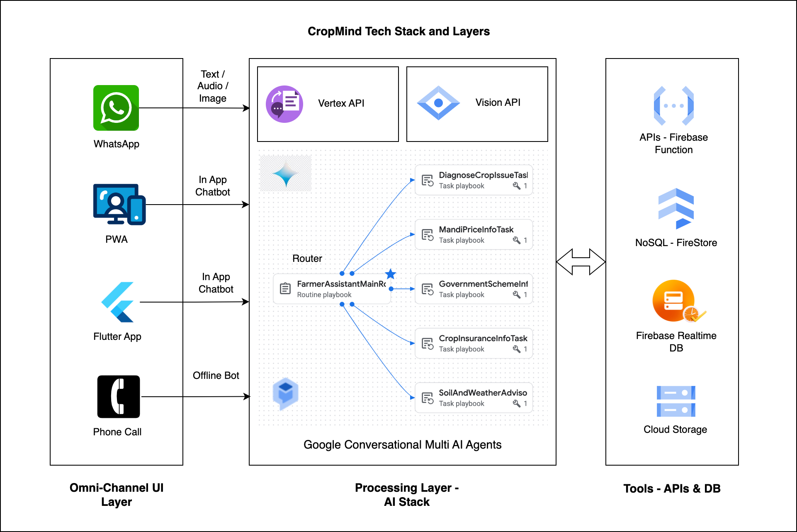
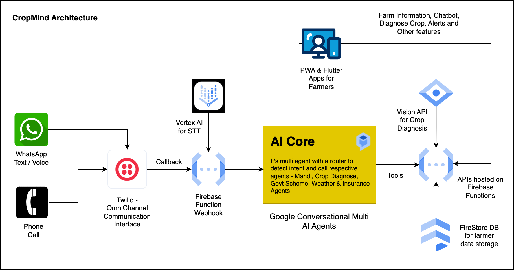

# 🌾 CropMind - AI-Powered Agricultural Disease Diagnosis

An intelligent Firebase Function that provides comprehensive crop disease diagnosis using AI, helping Indian farmers make informed decisions for better crop management.

## 🎯 Project Overview

CropMind is an AI-powered agricultural assistant that combines **Vertex AI Vision**, **Gemini Pro**, and **Google Cloud** services to provide farmers with comprehensive disease diagnosis, treatment plans, and economic insights.

## 🏆 Hackathon-Winning Features

### 🌱 **Comprehensive Disease Analysis**
- **AI-Powered Diagnosis**: Uses Gemini Pro Vision for accurate disease identification
- **Severity Assessment**: Low/Medium/High severity classification
- **Stage Detection**: Early/Mid/Late infection stage analysis
- **Confidence Scoring**: AI confidence levels for diagnosis reliability

### 💰 **Economic Empowerment**
- **Cost-Benefit Analysis**: Treatment cost vs. potential crop loss
- **ROI Calculations**: Return on investment for treatments
- **Market Price Integration**: Current crop market prices
- **Insurance Recommendations**: Government scheme awareness

### 🌍 **Environmental Awareness**
- **Weather-Based Timing**: Optimal treatment timing based on weather
- **Seasonal Considerations**: Seasonal disease patterns
- **Sustainable Options**: Both chemical and organic treatment recommendations
- **Environmental Impact**: Eco-friendly treatment alternatives

### 🏛️ **Government Integration**
- **Local Scheme Awareness**: PMKSY, PMFBY, and other government schemes
- **Subsidy Information**: Available subsidies for treatments
- **Regional Practices**: Location-specific agricultural practices
- **Resource Availability**: Local resource accessibility

### 📱 **Farmer-Centric Design**
- **Multilingual Support**: Hindi, Kannada, English support
- **Image Storage**: Complete diagnosis history with images
- **Nearby Dealers**: Local agricultural supplier information
- **Actionable Steps**: Step-by-step treatment instructions

### **Architecture**




## 🚀 API Endpoints

### Health Check
```bash
GET /ping
Authorization: your-token
```

**Response:**
```json
{
  "status": "success",
  "requestId": "req_123",
  "data": {
    "message": "server is up and running"
  }
}
```

### Crop Disease Diagnosis
```bash
POST /api/diagnose-crop
Content-Type: multipart/form-data
Authorization: your-token

Form Data:
- image: crop_photo.jpg (required)
- crop: "tomato" (required)
- user_id: "farmer_123" (required)
- location: "Bengaluru" (optional)
```

**Response:**
```json
{
  "status": "success",
  "requestId": "req_918273",
  "data": {
    "user_id": "farmer_123",
    "crop": "Tomato",
    "disease_name": "Powdery Mildew",
    "severity": "Medium",
    "stage": "Early",
    "diagnosis": "Fungal infection causing powdery white spots on leaves...",
    "confidenceScore": 88,
    "treatment": {
      "immediate_steps": [
        "Remove infected leaves immediately",
        "Apply sulphur-based fungicide within 24 hours"
      ],
      "pesticides": {
        "chemical": ["Sulphur-based Fungicide", "Copper-based Fungicide"],
        "organic": ["Neem oil spray", "Baking soda solution"]
      },
      "application": "Spray every 7-10 days, avoid during rain",
      "timeline": "2-3 weeks treatment cycle",
      "safety": "Wear protective gear, avoid spraying during flowering"
    },
    "prevention": {
      "measures": [
        "Maintain proper plant spacing",
        "Avoid overhead irrigation"
      ],
      "crop_rotation": "Avoid planting tomatoes in same area for 2-3 years",
      "soil_health": "Add organic matter, maintain pH 6.0-6.8",
      "water_management": "Water at soil level, avoid wetting leaves"
    },
    "economic": {
      "potential_loss": "30-50% yield reduction if untreated",
      "treatment_cost": "₹500-800 per acre",
      "roi": "₹15,000-20,000 savings per acre",
      "market_price": "₹40-60 per kg (current market)",
      "insurance": "Apply for PMFBY crop insurance"
    },
    "environmental": {
      "weather_timing": "Apply treatments in early morning",
      "seasonal_factors": "High humidity increases risk",
      "environmental_impact": "Organic treatments preferred for sustainability"
    },
    "local_context": {
      "regional_practices": "Common in Karnataka during monsoon",
      "resource_availability": "Sulphur fungicides available at local stores",
      "government_schemes": "Subsidy available under PMKSY"
    },
    "nearby_dealer": [
      {
        "name": "AgroMart Supplies",
        "address": "5th Main Rd, Koramangala, Bengaluru",
        "phone": "+91-9876543210",
        "latLng": [12.935, 77.614],
        "working_hours": "9am–6pm"
      }
    ]
  }
}
```

### Animal Detection
```bash
POST /api/detect-animals
Content-Type: application/json
Authorization: your-token

Body:
{
    "image_url": "https://<url-to-your-image.jpg>",
    "lat": 13.06,
    "lng": 77.47,
    "timestamp": "2025-07-27T10:00:00Z",
    "camera_id": "CAM_NORTH_4",
    "farm_id": "FARM123"
}
```
**Response (Success):**
```json
{
  "status": "success",
  "requestId": "req_12345",
  "data": {
    "message": "Animal detection processed and notification sent.",
    "firestore_doc_id": "doc_id_from_firestore",
    "realtime_db_path": "/animal_alerts/FARM123/alert_id_from_rtdb"
  }
}
```

### Weather Advisory
```bash
GET /api/weather?lat=13.06&lon=77.47
Authorization: your-token
```
**Response:**
*Returns a detailed weather and activity forecast JSON object from the PEAT-cloud API.*

### Government Schemes
```bash
GET /api/govt-schemes
Authorization: your-token
```
**Response:**
*Returns a list of dummy government schemes like PMFBY, PMKSY, etc.*

### Insurance Options
```bash
GET /api/insurance-options
Authorization: your-token
```
**Response:**
*Returns a list of dummy insurance options, including from Zuno General Insurance.*


## 🛠️ Technology Stack

- **Backend**: Firebase Functions (Python)
- **AI/ML**: 
  - Google Vertex AI Vision API
  - Gemini Pro Vision
- **Database**: 
  - Firestore
  - Firebase Realtime Database
- **Storage**: Google Cloud Storage
- **Authentication**: Firebase Auth
- **Deployment**: Firebase CLI

## 📋 Prerequisites

- Python 3.10+
- Node.js 20+ (for Firebase CLI)
- Google Cloud Project
- Firebase Project
- Gemini API Key

## 🚀 Setup Instructions

### 1. **Clone Repository**
```bash
git clone <repository-url>
cd crop_mind
```

### 2. **Install Dependencies**
```bash
cd functions
python -m venv venv
source venv/bin/activate  # On Windows: venv\Scripts\activate
pip install -r requirements.txt
```

### 3. **Environment Variables**
Create `.env` file in `functions/` directory:
```env
GEMINI_API_KEY=your-gemini-api-key
GOOGLE_APPLICATION_CREDENTIALS=path/to/service-account.json
```

### 4. **Firebase Setup**
```bash
npm install -g firebase-tools
firebase login
firebase use --add cropmind-89afe
```

### 5. **Deploy Functions**
```bash
firebase deploy --only functions --project cropmind-89afe
```

## 📊 Database Schema

### Firestore Collection: `diagnoses`
```json
{
  "user_id": "farmer_123",
  "timestamp": "2024-01-15T10:30:00Z",
  "request": {
    "crop": "tomato",
    "location": "Bengaluru",
    "image_size": 245760
  },
  "response": {
    // Complete diagnosis response
  },
  "image_url": "https://storage.googleapis.com/bucket/diagnoses/farmer_123/tomato_1705312200.jpg"
}
```

## 🔧 Configuration

### Firebase Configuration (`firebase.json`)
```json
{
  "functions": {
    "source": ".",
    "region": "asia-south1"
  }
}
```

### Requirements (`requirements.txt`)
```
firebase_functions~=0.1.0
python-dotenv
google-cloud-vision
google-cloud-aiplatform
google-generativeai
google-cloud-firestore
Pillow
```

## 🧪 Testing

### Local Testing
Start the local Flask server for testing:
```bash
cd functions
python main_local.py
```
The server will start on `http://localhost:5000`.

### API Testing
```bash
# Health Check
curl -X GET "https://us-central1-cropmind-89afe.cloudfunctions.net/ping_entry" \
  -H "Authorization: your-token"

# Disease Diagnosis
curl -X POST "https://us-central1-cropmind-89afe.cloudfunctions.net/diagnose_crop_entry" \
  -H "Authorization: your-token" \
  -F "image=@crop_photo.jpg" \
  -F "crop=tomato" \
  -F "user_id=farmer_123" \
  -F "location=Bengaluru"

# Animal Detection
curl --location 'http://localhost:5000/api/detect-animals' \
--header 'Content-Type: application/json' \
--header 'Authorization: your-token' \
--data '{
    "image_url": "https://<url-to-your-image.jpg>",
    "lat": 13.06,
    "lng": 77.47,
    "timestamp": "2025-07-27T10:00:00Z",
    "camera_id": "CAM_NORTH_4",
    "farm_id": "FARM123"
}'
```

## 🏆 Hackathon Impact

### **For Farmers:**
- **Immediate Action Plans**: Step-by-step treatment instructions
- **Economic Guidance**: Cost-benefit analysis and ROI
- **Local Context**: Region-specific recommendations
- **Government Awareness**: Scheme and subsidy information

### **For Agriculture:**
- **Sustainable Practices**: Organic treatment alternatives
- **Environmental Protection**: Eco-friendly recommendations
- **Knowledge Sharing**: Community disease tracking
- **Data-Driven Insights**: Historical diagnosis patterns

### **For India:**
- **Digital Agriculture**: AI-powered farming assistance
- **Economic Growth**: Improved crop yields and farmer income
- **Government Integration**: Scheme awareness and utilization
- **Rural Development**: Technology access for farmers

## 🤝 Contributing

1. Fork the repository
2. Create a feature branch
3. Make your changes
4. Test thoroughly
5. Submit a pull request

## 📄 License

This project is licensed under the MIT License - see the LICENSE file for details.

## 📞 Support

For support and questions:
- Email: sumitsaurabh2293@gmail.com
- GitHub Issues: [Create an issue](https://github.com/sumit-saurabh/cropmind/issues)

---

**Built with ❤️ for Indian Farmers** 